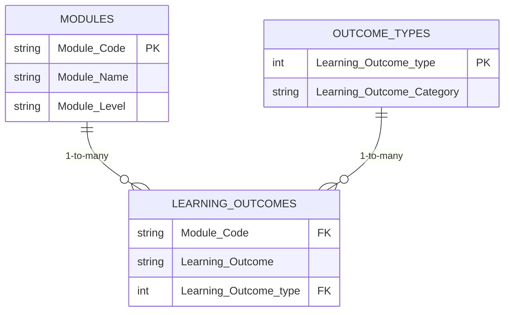

# 🗂️ Data Dictionaries


This document provides descriptions of all data fields across the three linked datasets in this curriculum analysis project. The datasets are relationally connected via `Module_Code` and `Learning_Outcome_type`.

## Dataset 1: Module Information
**File:** `modules.csv`  
**Primary Key:** `Module_Code`

| Field Name                     | Description |
|--------------------------------|------------|
| **Module_Code**                | The unique code assigned to each module. This code is used for identification and registration purposes within the university's systems. |
| **Module_Name**                | The name of the module, as listed in the university's course catalogue. |
| **Module_Level**               | The academic level or year of study at which the module is typically taken (e.g., Year 1 = Level 4, Year 2 = Level 5, Year 3 = Level 6). |
| **Theory_Practice**            | Indicates whether a module is classed a "theory" or "practice" (students must have a 50/50 split). |
| **Module_Credits**             | The number of academic credits awarded upon successful completion of the module, reflecting the workload and learning hours (e.g. 15, 30, 60). |
| **Optional_Mandatory**         | Specifies whether the module is a required component of the degree program ("Mandatory") or a student's choice ("Optional"). |
| **Co_Requisites**              | Modules that must be taken concurrently with this module. |
| **Pre_Requisites**             | Modules that must be successfully completed before enrolling in this module. |
| **Banned_Combinations**        | Modules that cannot be taken together due to overlapping content or other academic restrictions. |
| **Banner_URL**                 | A link to the module description page on the university's Banner system. |
| **Module_Recruitment_2022-23** | The number of students enrolled in the module during the 2022-23 academic year. |
| **Recurring_Course**           | Indicates whether the module was offered during the previous academic year (y, n). |
| **Basket**                     | The thematic 'basket' that the module falls into (e.g., "World Cinema", "Digital Media", "Media Industries"). |
| **Notes**                      | Any additional relevant information about the module. |
---

## Dataset 2: Course Learning Outcomes  
**File:** `learning_outcomes.csv`  
**Foreign Keys:**  
- `Module_Code` → `modules.csv`  
- `Learning_Outcome_type` → `outcome_types.csv`

| Field Name                 | Description |
|----------------------------|------------|
| **Module_Code**            | Links to parent module |
| **Learning_Outcome**       | Free-text outcome description |
| **Learning_Outcome_Order** | Display sequence (1-n) |
| **Level**                  | Academic level (e.g., "Level 4") |
| **Learning_Outcome_type**  | Category ID (1-6) |

---

## Dataset 3: Learning Outcome Types  
**File:** `outcome_types.csv`  
**Primary Key:** `Learning_Outcome_type`

| Field Name                 | Description |
|----------------------------|------------|
| **Learning_Outcome_type**  | Numeric ID (1-6) |
| **Learning_Outcome_Category** | Broad classification (e.g., "Critical Thinking") |

---

## Schema Visualization

### Mermaid ER Diagram


### Key Relationships
- Each **Module** (1) contains multiple **Learning Outcomes** (N)
- Each **Outcome Type** (1) categorizes multiple **Learning Outcomes** (N)

### How to Use This Schema
1. **Join datasets** in analysis:
   ```python
   # Python (pandas)
   import pandas as pd
   df = pd.merge(
       left=learning_outcomes,
       right=outcome_types,
       on="Learning_Outcome_type"
   )
   ```
2. **Validate integrity**:
   - All `Learning_Outcome_type` values in `learning_outcomes.csv` must exist in `outcome_types.csv`
   - All `Module_Code` values in `learning_outcomes.csv` must exist in `modules.csv`

